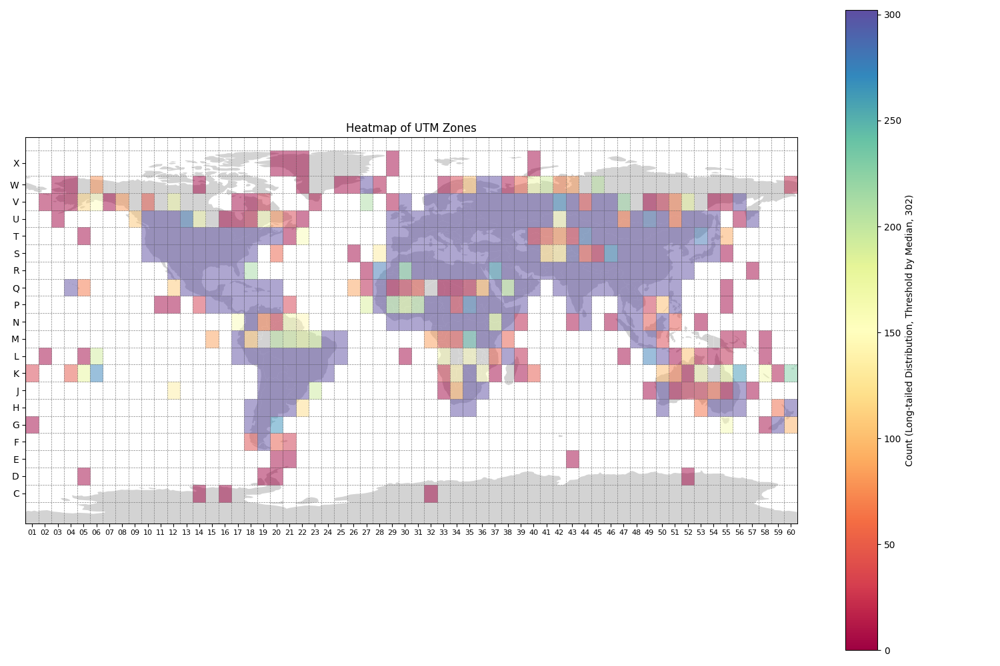
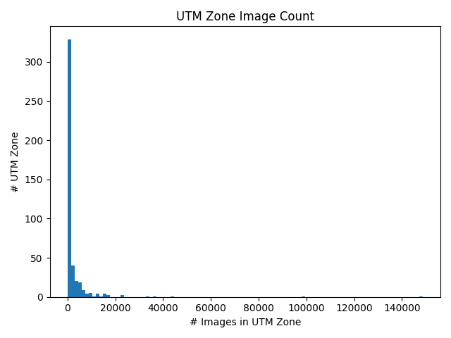

# RS5M: A Large Scale Vision-Language Dataset for Remote Sensing Vision-Language Foundation Model 

* Zilun Zhang, Tiancheng Zhao, Yulong Guo, Jianwei Yin

* Preprint: https://arxiv.org/abs/2306.11300


##  RS5M Dataset

Pre-trained Vision-Language Foundation Models utilizing extensive image-text paired data have demonstrated unprecedented image-text association capabilities, achieving remarkable results across various downstream tasks. A critical challenge is how to make use of existing large-scale pre-trained VLMs, which are trained on common objects, to perform the domain-specific transfer for accomplishing domain-related downstream tasks. In this paper, we propose a new framework that includes the Domain Foundation Model (DFM), bridging the gap between the general foundation model (GFM) and domain-specific downstream tasks. Moreover, we present an image-text paired dataset in the field of remote sensing (RS), RS5M, which has 5 million remote sensing images with English descriptions. The dataset is obtained from filtering publicly available image-text paired datasets and captioning label-only RS datasets with pre-trained models. These constitute the first large-scale RS image-text paired dataset. Additionally, we tried several Parameter-Efficient Tuning methods with Vision-Language Models on RS5M as the baseline for the DFM. Experimental results show that our proposed datasets are highly effective for various tasks, improving upon the baseline by $\sim$ 16 % in zero-shot classification tasks, and obtain good results in both Vision-Language Retrieval and Semantic Localization tasks.


[comment]: <## Under Construction>
[comment]: <We will release the training & inference code, checkpoints, and the dataset download link to this repo later this year.>


## MetaFile

The metafile of RS5M can be found here: https://huggingface.co/datasets/Zilun/RS5M/tree/v4/metadata


## Contact
Email: zilun.zhang@zju.edu.cn


[comment]: <WeChat: zilun960822>


[comment]: <Slack Group: https://join.slack.com/t/slack-nws5068/shared_invite/zt-1zpu3xt85-m8I3kVCp4qxAA1r1bDmKmQ>

## Statistics
### PUB11 Subset

| Name               | Amount |   After Keyword Filtering |   Download Image|  Invalid Image (Removed) |   Duplicate Image (Removed)|  Outlier images (Removed by VLM and RS Detector)|  Remain |
|:------------------:|:------:|:-------------------------:|:----------:|:------------------------:|:---------------------:|:------------------------------:|:--------:|
| LAION2B            | 2.3B   | 1,980,978   | 1,737,584   |             102          |        343,017        |          333,686               |1,060,779 |
| COYO700M           | 746M   | 680,089     | 566,076     |     28                   |245,650                |94,329                          | 226,069  |
| LAIONCOCO          | 662M   | 3,014,283   | 2,549,738   |       80                 |417,689                |527,941                         | 1,604,028|
| LAION400M          | 413M   | 286,102     | 241,324     |25                        |141,658                |23,860                          | 75,781    |
| WIT                | 37 M   | 98,540      | 93,754      |0                         |74,081                 |9,299                           | 10,374    |
| YFCC15M            | 15M    | 27,166      | 25,020      |0                         |265                    |15,126                          | 9,629     |
| CC12M              | 12M    | 18,892      | 16,234      | 0                        |1,870                  |4,330                           |10,034    |
| Redcaps            | 12M    | 2,842       | 2,686       | 0                        |228                    |972                             |1,486     |
| CC3M               | 3.3M   | 12,563      | 11,718      | 1                        |328                    |1,817                           |9,572     |
| SBU                | 1M     | 102         | 91          |0                         |4                      |36                              |51        |
| VG                 | 0.1M   | 26          | 26          | 0                        |0                      |20                              |6         |
| Total              | 4.2B   | 6,121,583   | 5,244,251   | 236                        |1,224,790              |1,011,416                       |3,007,809 |


### RS3 Subset

| Name               | Amount | Original Split | Has Class label |
|:------------------:|:------:|:--------------:|:---------------:|
|FMoW|727,144|Train|Yes|
|BigEarthNet|344,385|Train|Yes|
|MillionAID|990,848|Test|No|
|Total|2,062,377|-|-|

### Geo-Statistics
* Statistics of geometa for images contain the UTM zone, latitude, longitude information.
  * YFCC14M: 7841
  * FMoW: 727,144
  * BigEarthNet: 344,385




* Extract entity with "GPE" label using [NER from NLTK](https://medium.com/nirman-tech-blog/locationtagger-a-python-package-to-extract-locations-from-text-or-web-page-dbb05f1648d3)
      * Applied to captins in PUB11 subset
      * [Extraction Result](https://huggingface.co/datasets/Zilun/RS5M/blob/v4/geometa/RS5M_pub11_geolocation.csv)
      * 880,354 image-text pairs contains "GPE", and most of them are city/country names.


## Awesome Remote Sensing Vision-Language Models & Papers

* https://github.com/om-ai-lab/awesome-RSVLM

## BibTeX Citation

If you use RS5M in a research paper, we would appreciate using the following citations:

```
@misc{zhang2023rs5m,
      title={RS5M: A Large Scale Vision-Language Dataset for Remote Sensing Vision-Language Foundation Model}, 
      author={Zilun Zhang and Tiancheng Zhao and Yulong Guo and Jianwei Yin},
      year={2023},
      eprint={2306.11300},
      archivePrefix={arXiv},
      primaryClass={cs.CV}
}
```


